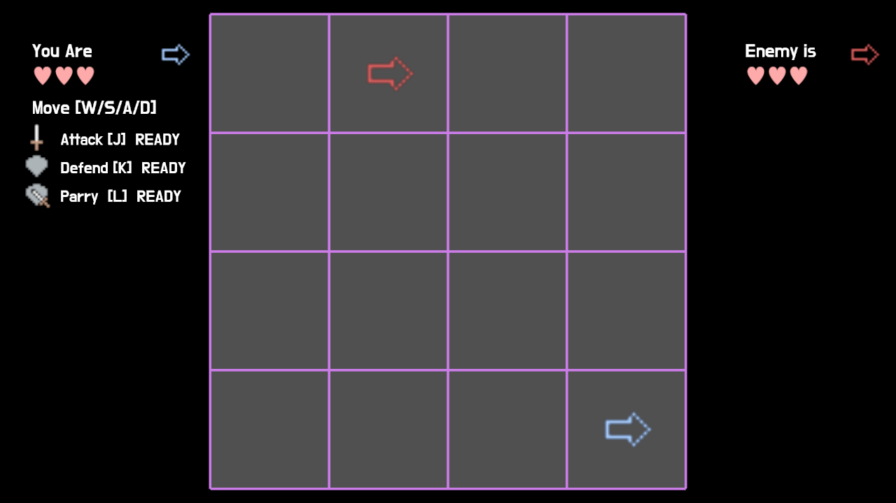

# Slay The Board

This is an assignment project for CMU 15466/15666 course.

#### Author: Jialan Dong

#### Design: 

It's a 2-player game. Players duel on a 4*4 grid. Each player can perform Move, Attack, Defend, and Parry. The first player that get the enemy's health down to zero wins.

#### Networking: 

Server-authoritative. Client sends intent only; server runs rules in `Game::update()` and broadcasts snapshots.

Messages: `C2S_Controls` (5 bytes) + `C2S_Action` (1-byte bitmask); server sends `S2C_State` snapshot.

**Where: send in `PlayMode::update()` / `Controls::send_controls_message()`, build in `Game::send_state_message()`, read in `Game::recv_state_message()`.

#### Screen Shot:

#### How To Play:

Each Player has 3 health. Players can

​	Move[W/S/A/D]: Move to the direction by 1 grid;

​	Attack[J]: Attack the facing direction. If the enemy is hit, they lose one HP; Has 2s cooldown;

​	Defend[K]: Defend the facing direction for 0.5s; Has 3s cooldown;

​	Parry[L]: Defend the facing direction for 0.5s, if successfully blocked an attack, attack the facing direction instantly.

#### Sources:

GPT is used by the project.

Font: https://fonts.google.com/specimen/Do+Hyeon

This game was built with [NEST](NEST.md).

